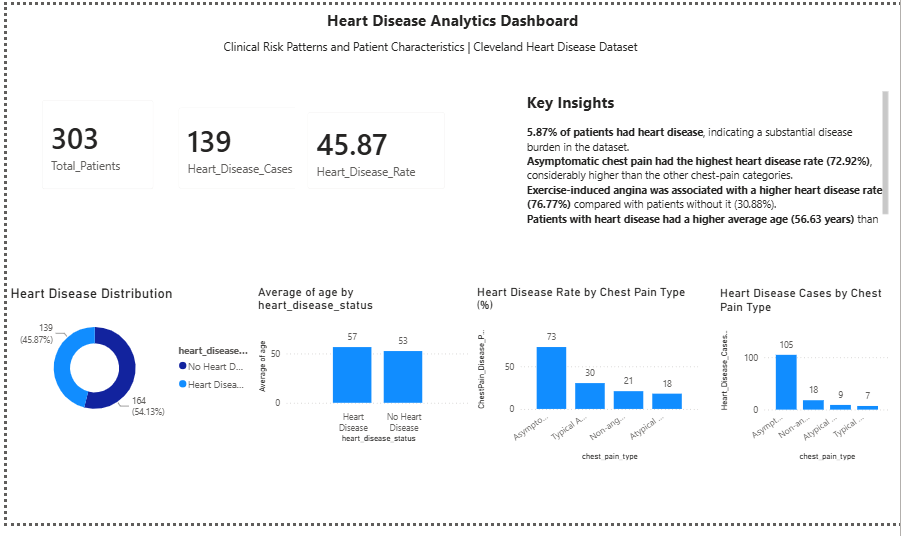

# Heart Disease Analytics — SQL & Power BI Healthcare Dashboard

## 1. Project Overview

This project analyzes patient-level heart disease data using **PostgreSQL, SQL, and Microsoft Power BI** to identify patterns associated with observed heart disease prevalence.

The objective was to transform raw healthcare data into structured analytical insights through SQL-based analysis and an interactive Power BI dashboard.

---

## 2. Business / Analytical Problem

Healthcare organizations can use data analytics to understand how patient characteristics and clinical indicators vary across different patient groups.

This project addresses the following questions:

- What proportion of patients in the dataset have heart disease?
- How does observed heart disease prevalence vary across chest pain categories?
- Is observed heart disease prevalence different among patients with exercise-induced angina?
- How does average age differ between patients with and without heart disease?
- How can these findings be communicated through an executive-friendly dashboard?

---

## 3. Dataset

The project uses a heart disease patient dataset containing demographic and clinical variables, including:

- Age
- Sex
- Chest pain type
- Resting blood pressure
- Cholesterol
- Maximum heart rate
- Exercise-induced angina
- Heart disease status

The dataset contains **303 patient records**.

---

## 4. Tools & Technologies

| Tool | Purpose |
|---|---|
| PostgreSQL | Data storage and SQL analysis |
| SQL | Data exploration, aggregation, and analysis |
| Microsoft Power BI | Interactive dashboard and visualization |
| DAX | Calculated measures and KPI development |

---

## 5. Analytical Workflow

### Step 1 — Data Preparation

The dataset was imported into PostgreSQL and examined for structure, categories, and data consistency.

### Step 2 — SQL Analysis

SQL queries were used to calculate:

- Total patient count
- Heart disease case count
- Overall heart disease prevalence
- Heart disease prevalence by chest pain type
- Heart disease prevalence by exercise-induced angina
- Average age by heart disease status
- Descriptive statistics for selected clinical variables

### Step 3 — Power BI Development

The dataset was connected to Power BI and transformed into an interactive analytical dashboard.

DAX measures were created for key KPIs, including:

- Total Patients
- Heart Disease Cases
- Heart Disease Rate

### Step 4 — Dashboard Development

The dashboard was designed to communicate key patterns through KPI cards and comparative visualizations.

---

## 6. Dashboard

The dashboard provides an executive-level view of observed heart disease patterns within the dataset.

### Key KPIs

- **Total Patients:** 303
- **Heart Disease Cases:** 139
- **Heart Disease Rate:** 45.87%

### Visualizations

- Heart Disease Distribution
- Heart Disease Cases by Chest Pain Type
- Heart Disease Rate by Chest Pain Type
- Average Age by Heart Disease Status

### Dashboard Preview



---

## 7. Key Findings

### Overall prevalence

**139 of 303 patients (45.87%)** in the dataset were classified as having heart disease.

### Chest pain type

Observed heart disease prevalence varied substantially across chest pain categories.

The **asymptomatic group had the highest observed heart disease rate at 72.92%**, while atypical angina had the lowest observed rate at approximately **18.00%**.

### Exercise-induced angina

Patients with exercise-induced angina showed a substantially higher observed heart disease rate:

- **Exercise angina = Yes:** 76.77%
- **Exercise angina = No:** 30.88%

### Age

The average age was higher among patients classified with heart disease:

- **Heart Disease:** 56.63 years
- **No Heart Disease:** 52.59 years

---

## 8. Analytical Recommendations

Based on the observed patterns:

1. **Investigate high-prevalence patient groups.**  
   Chest pain categories and exercise-induced angina showed substantial differences in observed heart disease prevalence and could be explored further in subsequent analysis.

2. **Use multiple patient characteristics together.**  
   Age, chest pain characteristics, and exercise-induced angina may provide more useful context when analyzed jointly rather than individually.

3. **Use dashboards to support data-driven investigation.**  
   Interactive visualization can help analysts and healthcare stakeholders identify patterns that warrant deeper investigation.

4. **Avoid interpreting associations as causation.**  
   The findings describe patterns within this dataset and do not establish that any individual variable causes heart disease.

---

## 9. Project Outcome

The project demonstrates an end-to-end healthcare analytics workflow:

**Raw Healthcare Data → PostgreSQL → SQL Analysis → DAX Measures → Power BI Dashboard → Insights → Recommendations**

The final dashboard converts patient-level data into a concise analytical view of heart disease prevalence and associated patient characteristics.

---

## 10. Limitations

- The analysis is based on a single dataset containing 303 observations.
- Observed associations do not establish causation.
- The dataset may not represent the broader population.
- The dashboard is intended for analytical exploration and should not be used as a standalone clinical diagnostic tool.
- Larger and more representative datasets would be required for stronger generalization.

---

## 11. Skills Demonstrated

### Technical Skills

- SQL
- PostgreSQL
- Data aggregation
- Data analysis
- DAX
- Power BI
- Dashboard development
- Data visualization

### Analytical Skills

- KPI development
- Pattern identification
- Comparative analysis
- Healthcare analytics
- Insight generation
- Data-driven recommendations

---

## 12. Repository Structure

```text
heart-disease-analytics/
│
├── README.md
│
├── data/
│   └── processed.cleveland.data
│
├── sql/
│   └── heart_disease_analysis.sql
│
├── powerbi/
│   └── Heart_Disease_Healthcare_Analytics.pbix
│
└── images/
    └── heart_disease_dashboard.png

    ## 13. Author Contribution

The project involved:

- Importing and exploring the healthcare dataset
- Performing SQL-based analysis in PostgreSQL
- Developing analytical measures using DAX
- Designing the Power BI dashboard
- Interpreting observed patterns
- Translating analytical results into data-driven recommendations
